# 🖩 Digital Calculator

Digital Calculator is a fully function Calculator Clone which is based on this [UI Design](https://www.figma.com/file/u5ZUqipus9HDydBEIU1ZSn/Neumorphism-UI-Design-by-%40feedlike-(Community)?node-id=0%3A1).
It has keyboard support and a few useful shortcuts for quick and easy access. It also has a dedicated dark mode theme for better accessibility.

Please star⭐ the repo if you like what you see😊.

## 📸 Screenshots
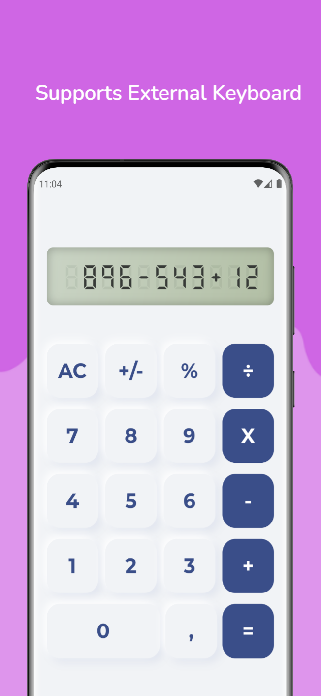 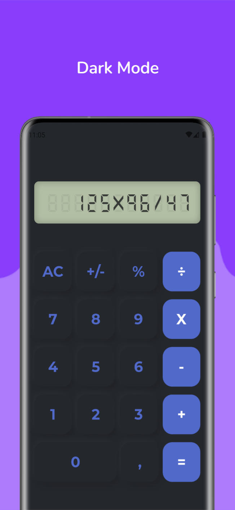
 
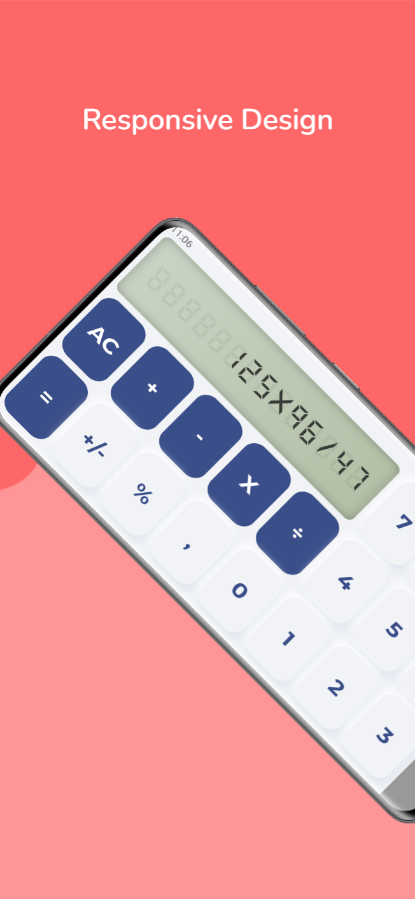 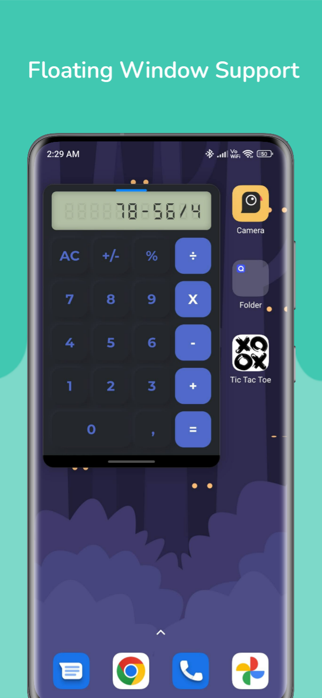

## 💻 Installation links
### [Click here to visit the website version](https://adeeteya.github.io/DigitalCalculator/#/)

### Android

(or)

### Windows

## ✨ Features
- [x] Keyboard Support (even for Android and iOS)
- [x] Shortcuts Support
- [x] Digital Display
- [x] Error Handling
- [x] Sign Change
- [x] Floating Window Support
- [x] Light Mode
- [x] Dark Mode
- [x] Responsive Design
- [ ] Scientific Calculator
- [ ] Calculator History

## ⌨ Shortcuts
| Shortcut                                                                                        | Action                    |
|-------------------------------------------------------------------------------------------------|---------------------------|
| 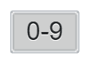                                                          | Inputs digits from 0 to 9 |
|                                                   | Addition                  |
| 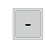                                            | Subtraction               |
| 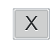  | Multiplication            |
| 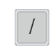                                             | Division                  |
| 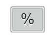                                                    | Percentage                |
| 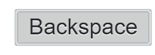                                                | Delete a Digit            |
| 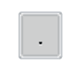 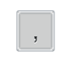             | Decimal Point             |
|  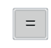               | Evaluate                  |
| 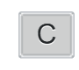                                                      | All Clear                 |
| 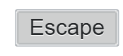            | Clear Character           |

## 🔌 Plugins
| Name                                                                              | Usage                                               |
|-----------------------------------------------------------------------------------|-----------------------------------------------------|
| [**flutter_inset_box_shadow**](https://pub.dev/packages/flutter_inset_box_shadow) | To use inset property for box shadows               |
| [**math_expressions**](https://pub.dev/packages/math_expressions)                 | For parsing and evaluating mathematical expressions |
| [**flutter_lints**](https://pub.dev/packages/flutter_lints)                       | For linting                                         |

## 🤓 Author
**[Aditya R](https://github.com/adeeteya)**

## 🔖 LICENCE
Copyright (c) 2023 Aditya R
[MIT LICENCE](https://github.com/adeeteya/DigitalCalculator/blob/master/LICENSE)

## 🙏 Attributions
<a href="https://www.flaticon.com/free-icons/calculator" title="calculator icons">Calculator icons created by Freepik - Flaticon</a>